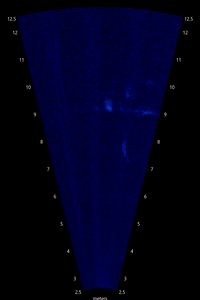

# PNNL-TUNAMELT

## Pacific Northwest National Lab's - Tracking Underwater Nautical Activity around Marine Energy LocaTions dataset

<p align="center">
    
    
</p>

This code accompanies the paper `PNNL-TUNAMELT: Towards automating the detection of interactions with marine energy devices using acoustic camera sensors` which proposes a novel, labeled data set and automated detection pipeline for detecting fish in acoustic camera video around operating tidal turbines.

### :fish: Disclaimer :fish:

This entire dataset was manually reviewed 3 times by fish biologists to ensure label quality and to identify possible fish collision or injury. To the best of our knowledge no fish were harmed in the making of this data set. Just keep swimmin' :tropical_fish:

# Getting Started

### Create a virtual environment

```bash
python3 -m venv env
source env/bin/activate
```

### Install dependencies

```bash
pip install -e .
```

### Download the data set

Download and unpack the dataset into `pnnl-tunamelt/data`

```bash
python scripts/download_dataset.py
```

The unpacked dataset structure is:
``` bash
PNNL-TUNAMELT
├── labels
│   └── cvat-video-1.1
│       ├── batched_test
│       ├── default
│       ├── test
│       └── train
└── mp4
    ├── batched_test
    ├── default
    ├── test
    └── train
```
Inside directories under `labels` are `.xml` files generated by [CVAT](https://github.com/cvat-ai/cvat) which contain the per-frame bounding boxes. Inside the directories under `mp4` are `.mp4` files of the acoustic camera videos. Test set video files were batched into video files of up to 300 frames for ease of processing. 

Other data locations:
- [Data.gov](https://catalog.data.gov/dataset/the-pnnl-tunamelt-dataset-for-automated-detection-around-marine-energy-devices)
- [MHKDR](https://mhkdr.openei.org/submissions/633)

## Examples

Executables used to run our method and visualize results are at `scripts/` and `scripts/experiments`. Analysis of experimental results were often done inside jupyters notebooks which are located at `notebooks/`. Some examples of what these scripts do are:

### Run then visualize TUNAMELT using parameter set 20 on a video 18

```bash
python scripts/experiments/demo_inference.py --params scripts/experiments/params/20.json --show True --id 18
```

### Rerun TUNAMELT on the entire training split of the data set

```bash
python scripts/experiments/multirun.py --params scripts/experiments/params/20.json --dataset train
```

### Visualize the results generated by TUNAMELT (you'll need to generate results first using run or multirun first!)

```bash
python scripts/experiments/view_result.py scripts/experiments/results
```

### Perform a hyperparameter search using the training split

```bash
python scripts/experiments/multirun.py --params scripts/experiments/params/hparam_search.json --datset train
```

### Rerun the ablation study

```bash
python scripts/experiments/ablation_tracklet.py
```

# More Information

## Expected Directory Structure

```bash
pnnl-tunamelt
├── data
├── env
├── LICENSE
├── MANIFEST.in
├── media
├── notebooks
├── pyproject.toml
├── README.md
├── scripts
└── src
```

## Creating symlinks for the data directories

The code as it's written relies on a certain directory structure:

```bash
# for methods execution and results generation
ln -s <path/to/my/data> pnnl-tunamelt/data
# for results analysis in notebooks
ln -s <path/to/my/data> pnnl-tunamelt/notebooks/data
```

The directory structure should then look like:

```bash
pnnl-tunamelt/data/PNNL-TUNAMELT
├── labels
└── mp4
```

Currently `cvat-video-1.1` is the only format of labels supported

## Data set label structure

During data set creation video labels are converted from `xml` files into python objects. Below is the structure of the python objects returned by the data loader:

```python
{'test': [
    {
        'filename': '2010-09-08_074500_HF_S002_S001.mp4',
        'tracks': [
            {
                'frames': [
                    {'box': ((486, 1011), (542, 1062)),
                    'frame': 16,
                    'keyframe': 1,
                    'occluded': 0,
                    'outside': 0},
                    {'box': ((455, 1016), (511, 1067)), ...
                ]
                'label': 'target',
                'track_id': 0
            },
                'frames': ...
        ],
        'video_id': 12,
        'video_length': 160,
        'video_shape': {'height': 1792, 'width': 1032}
    }
]
}
```

## About pCloud Data Downloads

### Manually downloading the data set

The TUNAMELT data set proposed in this work is hosted on pcloud. A [web interface link](https://u.pcloud.link/publink/show?code=k76italK) is provided. For those who want a direct download link in order to download the data in a headless environment (such as a terminal session), a few steps must be taken.

### Creating a direct download link with pcloud

We will first use pcloud's web API to generate a direct download link. To do so, we will take the `code` parameter in web interface link, and pass it into the pcloud web API as shown below. **This link will always remain the same and can be copy/pasted.**

```
https://api.pcloud.com/getpublinkdownload?code=k76italK&forcedownload=0
```

This will return a page like the below. **This return will change for each request, as the direct download link always expires in one day!**

```
{
	"result": 0,
	"expires": "Sun, 12 Jan 2025 00:18:11 +0000",
	"dwltag": "UJFEyYCyJkhOOariSp0I5B",
	"path": "\/cBZnt4E1dZHhHGlcZZZ09k2XkZTFZZGiFZkZnR6fMJZR4ZoQZWQZ28ZJYZk8Z3HZVFZqQZJ8ZbLZBYZTRZmQZtd8tVZmvXij5CMNlhKk6hSqB8iU8gyhCLV\/PNNL-TUNAMELT.tar.gz",
	"hosts": [
		"p-def4.pcloud.com",
		"vc1044.pcloud.com"
	]
}
```

We can then choose a host to download from either `p-def4.pcloud.com` or `vc1044.pcloud.com` and append the `path` with backslashes removed -
`/cBZnt4E1dZHhHGlcZZZ09k2XkZTFZZGiFZkZnR6fMJZR4ZoQZWQZ28ZJYZk8Z3HZVFZqQZJ8ZbLZBYZTRZmQZtd8tVZmvXij5CMNlhKk6hSqB8iU8gyhCLV/PNNL-TUNAMELT.tar.gz` - to create the direct download link. The URL for this generated (and likely now expired) direct download path is given below. This can then be used with `wget` to download the data set in a terminal session.

```
https://p-def4.pcloud.com/cBZnt4E1dZHhHGlcZZZ09k2XkZTFZZGiFZkZnR6fMJZR4ZoQZWQZ28ZJYZk8Z3HZVFZqQZJ8ZbLZBYZTRZmQZtd8tVZmvXij5CMNlhKk6hSqB8iU8gyhCLV/PNNL-TUNAMELT.tar.gz
```

## About the Computer Vision Annotation Tool (CVAT)

[CVAT](https://github.com/cvat-ai/cvat/tree/develop) is an open-source image and video labeling tool that can be downloaded and stood up. We used CVAT's docker image to create a video labeling platform for our expert-annotators to identify targets of interest in video.

### Exporting Video Annotations from CVAT

Exporting all project annotations in CVAT does not preserve per-video frame information (at the time of writing). We therefore have to export each task manually. To do so using the CVAT CLI create a python environment [via the linked](https://github.com/cvat-ai/cvat/tree/develop/cvat-cli) then use the below to export annotations from a specific task (or just download annotations for each video by hand):

```bash
# format = CVAT for images 1.1
# task = 103
cli.py dump --format "CVAT for images 1.1" 103 output.zip
```

